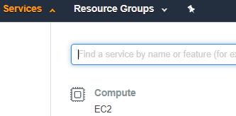
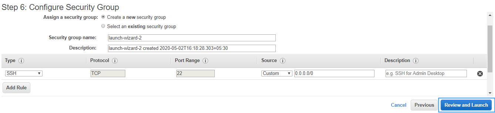
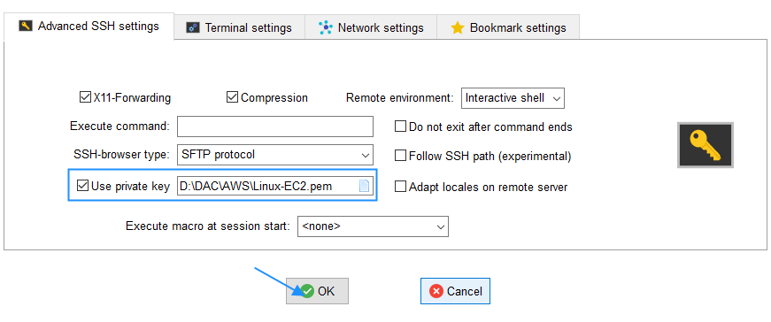

**EC2:**

Amazon Elastic Compute Cloud (EC2) is an example of IAAS and one of the most used and most basic services in Amazon. It is a machine with an operating system and hardware components of your choice. But the difference is that it is totally virtualized. You can run multiple virtual computers in a single physical hardware.

EC2 enables on-demand, scalable computing capacity in the AWS cloud. Amazon EC2 instances eliminate the up-front investment for hardware, and there is no need to maintain any rented hardware. It enables you to build and run applications faster. You can use EC2 in AWS to launch as many virtual servers as you need. Also, you can scale up or down when there is an increase or decrease in the website traffic.

**Benefits of EC2:**

1. Auto-scaling: Auto-scaling is basically providing resources according to the demand. They either scale up or scale down corresponding to the increase or decrease in demand.
2. Pay-as-you-go: You will be charged by the hour, and you have to pay only for what you have used. Even when you use your Amazon EC2 instances services for a few hours, you only need to pay for that time period and nothing more.
3. Increased Reliability: AWS is spread across worldwide which helps your business when it is expanding. Also, this will increase the load speed of your application around the world. You can always store multiple copies of your application in multiple AZs so that when one data center fails or loses data, the application will not fail completely.
4. Elasticity: Instead of 10 low-configuration machines, you could rent a single high-configuration machine with an OS of your preferred choice for your application. Elasticity is the feature from which Elastic Compute Cloud got its name.

**Creating an AWS EC2 Instance from scratch:**

1. Open the AWS Management Console, click on the Services drop-down and select EC2 under the compute category.

2. Click on the Launch Instance button at the top left of the screen.

3. Select **Amazon Linux 2 AMI (HVM).**

4. Select the Instance type with 1 vCPU and 1 GiB Memory and click the &quot;Next: Configure Instance Details&quot; button at the bottom right of the screen.

5. Configure the Instance based on your requirement and click the &quot;Next: Add Storage&quot; button.

6. You can update the storage size to the amount you need and click the &quot;Next: Add Tags&quot; button.

7. Add a tag by clicking at the &quot;Add Tags&quot; button. The tag is of a Key-Value type with key=Name and Value=name with which you can identify the particular instance while it is running and then click the &quot;Next: Configure Security Group&quot; button.

8. Configure the security group by selecting the &quot;Create a **new** security group&quot; and then clicking the &quot;Review and Launch&quot; button.

9. Have a review on the instance launch details. If you need to make any update you can get it done by going back to that section. Click &quot;Launch&quot; button once you are good to go.

10. Choose &quot; **Create a new key pair**&quot; from the popup box, give a name for the key pair, and then click on Download Key Pair. Keep the downloaded key pair file in a safe location so that you can access it later. The &quot;Launch Instance&quot; button will be enabled once you are done with downloading the Key Pair.

Your EC2 will be launched once you click the &quot;Launch Instance&quot; button.

Wait till your instance initializes, that is, till your 2/2 checks are done.

**Connecting the instance through an SSH client:**

Download and install the **Mobaxterm** a free SSH client using which you can access your EC2 instance.

The hyperlink for getting the setup is [https://mobaxterm.mobatek.net/download.html](https://mobaxterm.mobatek.net/download.html)

Once you are done with the installation of Mobaxterm, launch the application and follow the below steps:

1. Start a new session by clicking on the Session button at the top left of the screen and the select SSH.

 

2. Once you are done, copy the IPv4 Public IP from the Launch Description tab on the EC2 page of AWS and paste it in the Remote Host text box of Mobaxterm application and then add the username as ec2-user and then click the Advanced SSH settings tab.

3. In the Advanced SSH settings, select the &quot;Use private Key&quot; option and then add the path of the .pem file- the Key Pair file that you&#39;ve downloaded at the time of launching the EC2 instance and then select OK button.

Once you hit the OK button, you can start using your EC2 instance on Mobaxtem.

