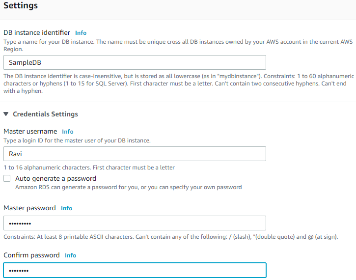
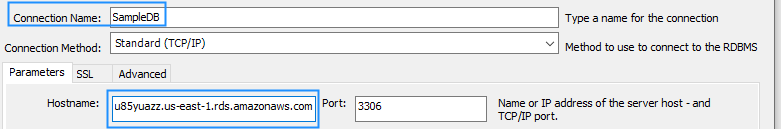

**What is RDS?**

The Amazon Relational Database Service (RDS AWS) is a web service (PAAS) that makes it easier to set up, operate, and scale a relational database in the cloud. It provides cost-efficient, re-sizable capacity in an industry-standard relational database and manages common database administration tasks. It frees you to focus on your applications so you can give them the fast performance, high availability, security and compatibility they need.

So people often develop a misconception when they confuse RDS with a database. RDS is not a database; it&#39;s a service that manages databases.

Amazon RDS is available on several database instance types - optimized for memory, performance or I/O - and provides you with six familiar database engines to choose from, including Amazon Aurora, PostgreSQL, MySQL, MariaDB, Oracle Database, and SQL Server. You can use the AWS Database Migration Service to easily migrate or replicate your existing databases to Amazon RDS.

**Benefits of using RDS:**

1. Easy to administer: Amazon RDS makes it easy to go from project conception to deployment. Use the Amazon RDS Management Console, the AWS RDS Command-Line Interface, or simple API calls to access the capabilities of a production-ready relational database in minutes. No need for infrastructure provisioning and no need for installing and maintaining database software.
2. Highly scalable: You can scale your database&#39;s compute and storage resources with only a few mouse clicks or an API call, often with no downtime.
3. Available and durable: Amazon RDS runs on the same highly reliable infrastructure used by other Amazon Web Services. When you provision a Multi-AZ DB Instance, Amazon RDS synchronously replicates the data to a standby instance in a different Availability Zone (AZ). Amazon RDS has many other features that enhance reliability for critical production databases, including automated backups, database snapshots, and automatic host replacement.
4. Fast: Amazon RDS supports the most demanding database applications.
5. Secure: Amazon RDS makes it easy to control network access to your database. Amazon RDS also lets you run your database instances in Amazon Virtual Private Cloud (Amazon VPC), which enables you to isolate your database instances and to connect to your existing IT infrastructure through an industry-standard encrypted IPsec VPN. Many Amazon RDS engine types offer encryption at rest and encryption in transit.
6. Inexpensive: You pay very low rates and only for the resources you actually consume. In addition, you benefit from the option of On-Demand pricing with no up-front or long-term commitments, or even lower hourly rates via our Reserved Instance pricing.

**Hands-On**

1. First select the RDS service from the AWS Management Console.

2. Click on the &quot;Create database button.

3. You can choose any one amongst **Standard Create** or **Easy Create** as the database creation method. Let&#39;s select the **Standard Create** method.

4. Select **MySQL** as the Engine type.

5. Select the version that you wish to use from the Version Drop down list. I&#39;m selecting the latest one i.e. 8.0.17.

6. Select **Free Tier** as the template.

7. Set an identifier for your database instance, master username and password which would be needed at the time you need to set n your MySQL application. 

8. Scroll down to the **Connectivity** section and click on **Additional connectivity configuration** and set **Publicly accessible** option to &quot;Yes&quot; and then click the &quot; **Create database**&quot; button at the bottom of the screen.

Wait until the status of Database is updated to &quot;Available&quot;. 

**Using RDS on MySQL workbench:**

1. Click on the &#39;+&#39; icon of the MySQL workbench.

2. Go to your RMS on the AWS portal and copy the &quot;Endpoint&quot; in the Connectivity and Security section and paste it into the &quot;Hostname&quot; field of MySQL Workbench. Set the Connection name as per your wish.

AWS portal:

Workbench:

3. Enter the username and password that you&#39;ve set as the Master username and password at the time of RWS creation (at step 7) and click OK.

4. Click on &quot;Test Connection&quot; button and once tested successively, click on the OK button.

5. You can now see that the connection is set on MySQL Workbench and once you click it you can now start using your database.

