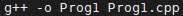

**Step 1: Install Required Tools**

1. In a terminal session in the AWS Cloud9 IDE, confirm whether GCC is already installed by running the **g++ --version** command. If successful, the output contains the GCC version number. Otherwise, an error message should be output.
2. If GCC is installed then run the **yum update** command (on Amazon Linux) to help ensure the latest security updates and bug fixes are installed.

**sudo yum -y update**

If not installed run the **yum install** command:

**sudo yum -y install gcc-c++**

1. Confirm that GCC is now successfully installed by running the **g++ --version** command. If successful, the output contains the GCC version number.

**Step 2: Add Code**

In the AWS Cloud9 IDE, create a file with this content, and save the file with the name Prog1.cpp.

**Step 3: Compile and Run the Code**

Compile the program using the command: 

Run the program using the command: 

- g++ is the invocation of the C++ component of GCC.
- cpp is the c++ source file you wish to compile.
- -o Prog specifies the name of the output file you wish to create once the source is compiled. The target source file and the target output file can be inverted if you wish.

**Output:**

