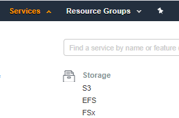
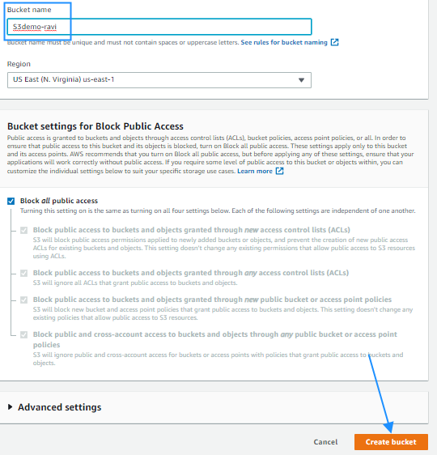
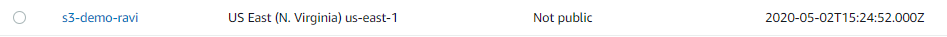
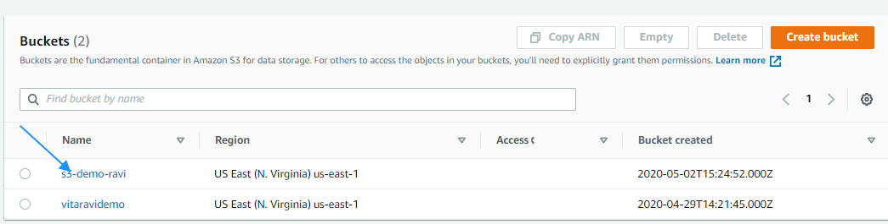
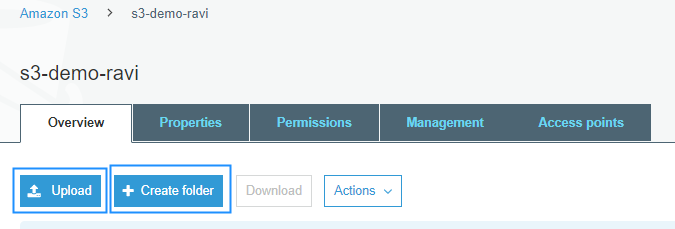
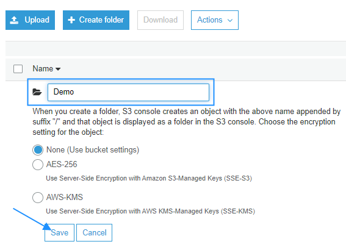
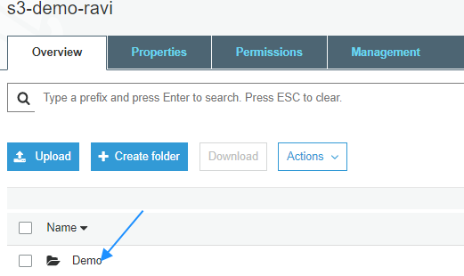
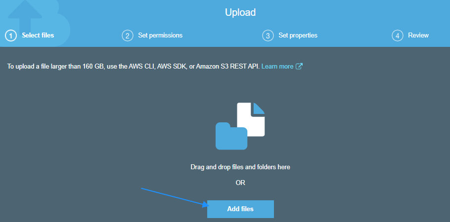
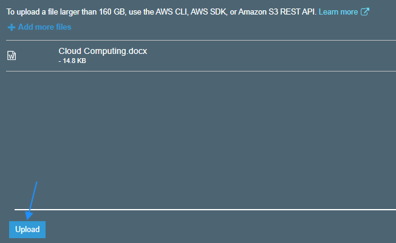

**What is S3?**

Amazon Simple Storage Service (Amazon S3) is object storage built to store and retrieve any amount of data from anywhere and at any time on the Internet. You can use Amazon S3 to store and retrieve any amount of data at any time, from anywhere on the web. It offers an extremely durable, highly available, and infinitely scalable data storage infrastructure at very low costs.

Amazon S3 stores data as objects within buckets. An object consists of a file and to store an object in Amazon S3, you upload the file you want to store to a bucket. When you upload a file, you can set permissions on the object. Buckets are the containers for objects. You can have one or more buckets. For each bucket, you can control access to it (who can create, delete, and list objects in the bucket).

**Advantages of using Amazon S3:**

Following are some of the advantages of using Amazon S3:

1. Creating buckets – Create and name a bucket that stores data. Buckets are the fundamental containers in Amazon S3 for data storage.
2. Storing data – Store an infinite amount of data in a bucket. Upload as many objects as you like into an Amazon S3 bucket. Each object can contain up to 5 TB of data. Each object is stored and retrieved using a unique developer-assigned key.
3. Downloading data – Download your data or enable others to do so. Download your data anytime you like, or allow others to do the same.
4. Permissions – Grant or deny access to others who want to upload or download data into your Amazon S3 bucket.
5. Standard interfaces – Use standards-based REST and SOAP interfaces designed to work with any internet-development toolkit.

**Creating an AWS S3 Bucket:**

1. Login to the AWS Management Console and select S3 from the Services section.

2. Click on the &quot;Create bucket&quot; button.
3. Next enter a unique bucket name which is unique across AWS and hit the &quot;Create bucket&quot; button.

And the bucket is now ready.

**Creating folder/Adding files in S3 bucket:**

1. Login to the AWS Management Console and select S3 from the Services section.

2. Click on the bucket name in the Buckets list in which you wish to upload your files.

3. Click on the &quot;Upload&quot; button if you wish to upload your files directly in the bucket or click on &quot;Create folder&quot; button if you wish to create a folder in your bucket where you want to upload your files.

4. While creating a folder you need to enter the folder name that you wish to create and then click the &quot;Save&quot; button.

5. Click on the folder name and then click on the upload button.

6. Click on the &quot;Upload&quot; button and then click on &quot;Add files&quot; button on the pop-up screen.

7. Add the file which you wish to store and then click on the &quot;Upload&quot; button at the bottom left of the pop-up screen.

You can now see that the file has been uploaded in your bucket.